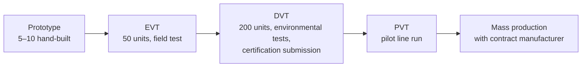
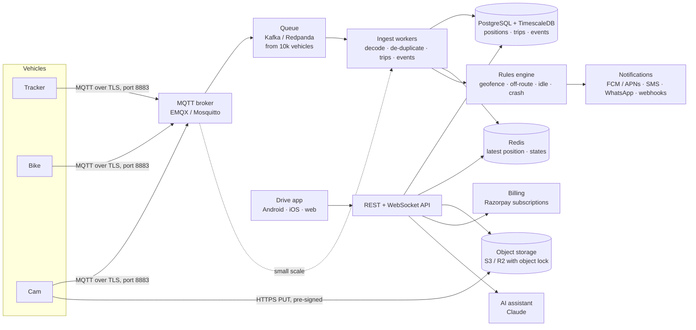
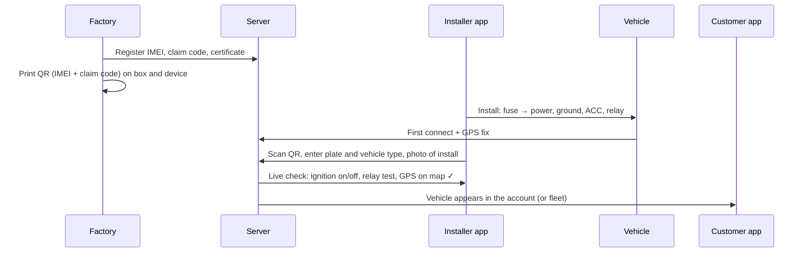

# Drive: build and scale guide

How to build the trackers, run the servers, connect them to the app and put them on the road for 1,
10, 100, 1,000 and 10,000+ vehicles. It includes a cost-benefit analysis.

> **All prices here are planning estimates** (India, 2026, before GST) for sizing and budgeting.
> Get real quotes from component distributors, your contract manufacturer and your cloud provider
> before committing. The parts-level reference design, wiring and firmware notes are in
> **[hardware.md](hardware.md)**.

## Contents

1. [The three devices](#1-the-three-devices)
2. [Components and bill of materials](#2-components-and-bill-of-materials)
3. [Treating the hardware for life in a vehicle](#3-treating-the-hardware-for-life-in-a-vehicle)
4. [Manufacturing, testing and certification](#4-manufacturing-testing-and-certification)
5. [Server side](#5-server-side)
6. [Integrating with the app](#6-integrating-with-the-app)
7. [Provisioning and installation](#7-provisioning-and-installation)
8. [Rollout by scale: 1 → 10,000+](#8-rollout-by-scale-1--10000)
9. [Cost-benefit analysis](#9-cost-benefit-analysis)
10. [Risks and how to handle them](#10-risks-and-how-to-handle-them)

---

## 1. The three devices

One mainboard design, three builds. That keeps firmware, testing and stock simple.

| | **Drive Tracker** | **Drive Bike** | **Drive Cam** |
|---|---|---|---|
| For | Cars, trucks | Bikes, scooters, autos | Taxis, buses |
| Size | ~90 × 60 × 22 mm | ~70 × 40 × 18 mm, potted | Windscreen unit + rear camera |
| Ingress | IP54 (behind the dash) | **IP67** (exposed to rain and washing) | IP40 (inside the cabin) |
| Backup power | 1000 mAh LiFePO4 or supercap | 500 mAh LiFePO4 | Supercap (safe parking-mode shutdown) |
| Relay | Immobilizer, 30 A | Immobilizer, 20 A | Immobilizer, 30 A |
| Extras | CAN transceiver, mic | Tilt / tow sensor | Front + cabin IR camera, mic, panic button |
| Price (buy / rent) | ₹3,999 / ₹149 per month | ₹2,499 / ₹99 per month | ₹8,999 / ₹349 per month |

## 2. Components and bill of materials

### Drive Tracker (car / truck)

| Block | Part (or equivalent) | 1 unit ₹ | 1,000 units ₹ | Notes |
|---|---|---|---|---|
| MCU | ESP32-S3-WROOM-1 N16R8 | 450 | 260 | BLE for driver phone ID, TWAI for CAN |
| 4G modem | SIMCom A7672S / Quectel EC200U | 1,300 | 850 | LTE Cat-1 + 2G fallback, SMS; TEC-certified module |
| GNSS | Quectel L76K (or u-blox M10 for flyovers) | 450 | 260 | GPS + NavIC + GLONASS + BeiDou |
| IMU | ST LSM6DSOX | 350 | 110 | 100 Hz crash / harsh-driving / tow wake |
| Power front end | TPS54202 buck + SMBJ33A TVS + reverse-polarity FET + fuse | 250 | 120 | Survives load dump and cranking dips |
| Backup power | 1000 mAh LiFePO4 + charger | 350 | 170 | Safer than Li-ion at dashboard temperatures |
| Immobilizer | 30 A automotive relay + driver + flyback | 150 | 70 | Wired normally closed |
| CAN | SN65HVD230 | 100 | 35 | Optional per car model |
| Ignition / inputs | PC817 optocouplers | 20 | 8 | ACC, door, panic |
| Storage | microSD 8 GB (or 128 Mbit SPI flash) | 250 | 90 | Offline buffer, weeks of points |
| Mic | INMP441 I2S MEMS | 200 | 60 | Cabin audio around incidents |
| Antennas | LTE FPC + active GNSS patch | 400 | 150 | |
| PCB + assembly | 4-layer, SMT, conformal coat | 900 | 180 | Prototype PCB is the big one-off cost |
| Enclosure, harness, label | ABS/PC + 6-pin harness + fuse holder | 450 | 120 | Injection-moulded at volume |
| **Total BOM** | | **~₹5,600** | **~₹2,480** | |
| Test, packaging, warranty reserve | | | ~₹350 | |
| **Landed cost** | | | **~₹2,830** | **vs ₹3,999 price → ~₹1,170 margin** |

### Drive Bike

This is the Drive Tracker without CAN and mic, with a smaller cell and **potted IP67** housing and a
tilt/tow wake on the IMU.
**~₹1,700 at 1,000 units** (landed ~₹1,950) vs ₹2,499 price.

### Drive Cam

This is the Drive Tracker board plus a dual-channel dashcam module (for example a SigmaStar or Novatek SoC,
1440p front + 1080p IR cabin), eMMC/SD for loop recording, supercap, and a panic button for AIS-140.
**~₹5,800 at 1,000 units** (landed ~₹6,300) vs ₹8,999 price.

> Buying an existing certified AIS-140 tracker or a 4G dashcam from an ODM and flashing your own
> firmware or pointing it at your server is a faster route for the first 100–1,000 units.
> Build your own board when volume justifies it.

## 3. Treating the hardware for life in a vehicle

A vehicle is a harsh place: 85 °C on a parked dashboard in May, −5 °C in a hill-station winter,
constant vibration, 12 V spikes, rain and pressure washers for bikes. "Treating" the hardware means
designing and processing it so it survives years of this.

| Threat | Treatment |
|---|---|
| **Heat** (dashboard 85 °C, engine bay more) | Automotive-grade (−40 to +85 °C) parts; **LiFePO4 or supercap**, never plain Li-ion on a dashboard; mount under the dash, not on top; thermal throttle of the modem above 75 °C |
| **Battery safety** | Cell with protection IC, charge only between 0–45 °C, BIS-certified cells; firmware stops charging when hot |
| **Electrical spikes** (load dump up to ~40 V, cranking dips to 6 V) | TVS diode, reverse-polarity FET, wide-input buck (4.5–40 V), 2 A inline fuse at the battery tap |
| **Vibration** | Board locked with screws + foam, no heavy parts on long leads, locking connectors, strain relief on the harness, thread-locker on screws |
| **Moisture, dust, condensation** | **Conformal coating** (acrylic or silicone) on every board; IP54 housing for cars; **potting** + IP67 gasket for bikes; breathable vent membrane to stop condensation |
| **ESD and handling** | ESD protection on all external lines; grounded workstations and ESD bags in assembly |
| **Antenna placement** | GNSS patch facing the sky (under the dash top or behind a plastic panel, not under metal or metallised film); LTE antenna away from the GNSS patch |
| **Tampering** | Hidden install, no LEDs visible from outside, backup power, tamper alert when main power or GNSS is lost |
| **Long life** | Watchdog + brown-out reset; dual-bank OTA firmware with automatic rollback; logs rotated on flash |

## 4. Manufacturing, testing and certification

### Build flow

- Use an Indian EMS / contract manufacturer (for example in Bengaluru, Noida or Chennai) for SMT
  assembly. PLI and Make-in-India sourcing helps with fleet and government tenders.
- An injection-mould tool for the enclosure costs about ₹2–4 lakh. 3D-printed or off-the-shelf
  housings are fine for the first 200.

### Tests on every unit (end-of-line)

1. Flash firmware and write IMEI + claim code + QR label.
2. Power test at 9, 12, 24 and 32 V; current in sleep mode (target < 3 mA).
3. GNSS fix from a re-radiating antenna, or a GNSS simulator, in under 60 s.
4. LTE registration and one MQTT round trip to the factory test server.
5. IMU self-test, relay click, ignition input, SD read/write, mic level.
6. **Burn-in**: 8–24 h powered at 60 °C for a sample of each batch (all units during the pilot).

### Qualification tests (per design)

| Test | Standard / method |
|---|---|
| Temperature cycling, −20 to +85 °C | IEC 60068-2-14 |
| Damp heat | IEC 60068-2-78 |
| Vibration and shock | IEC 60068-2-6 / -27, or AIS-140 test schedule |
| Ingress (IP54 / IP67) | IEC 60529 |
| Automotive transients | ISO 7637-2, ISO 16750-2 |
| EMC | AIS-004 / CISPR 25 |

### Certifications in India

| Certificate | Needed for | Rough cost & time |
|---|---|---|
| **TEC / MTCTE** | Any device with a cellular modem (use a pre-certified module to simplify) | ₹2–6 lakh, 2–4 months |
| **WPC ETA** | Wi-Fi / Bluetooth radios | ₹20–50k, 2–6 weeks |
| **BIS (IS 16046)** | Lithium cells and packs | Buy BIS-certified cells |
| **AIS-140** (ARAI / ICAT) | Commercial and public-service vehicles (taxis, buses, trucks carrying goods under state mandates) | ₹8–15 lakh, 3–6 months; also needs state backend (VLTD) integration |
| **Dashcam** | No specific certificate; follow DPDP for audio/video | |

Private cars and bikes don't need AIS-140.

## 5. Server side

### Architecture

Start with **[Traccar](https://www.traccar.org)** (open source, runs on one small server and speaks
most tracker protocols). Move to the custom MQTT pipeline once you pass a few hundred vehicles or need
features Traccar can't do. The app talks to your API either way.

### Load per vehicle (planning numbers)

| Quantity | Per vehicle | Notes |
|---|---|---|
| Drive time | ~4 h/day (car), ~12 h/day (taxi) | |
| Points | 1 per 10 s sent (1 s logged on device) → 1,440/day (car), 4,320/day (taxi) | 1 Hz batches around events |
| Messages | 1 MQTT message per 10 s while driving, 1 per 30 min parked | |
| Data | ~40–60 MB/month on the SIM | Video clips only on events |
| DB storage | ~100 bytes/point raw, ~10–15 bytes compressed | TimescaleDB native compression |

### Server sizing by scale

| Vehicles | Setup | Monthly cost (₹, est.) | Per vehicle |
|---|---|---|---|
| **1** | Traccar on the smallest VPS (1 vCPU / 1 GB) in Mumbai, or on a home Raspberry Pi | 400–800 | ₹400–800 |
| **10** | Traccar + PostgreSQL on a 2 vCPU / 2 GB VPS, daily backup | 800–1,500 | ₹80–150 |
| **100** | 2 vCPU / 4 GB app server (API + ingest + Mosquitto), managed PostgreSQL (small), object storage, uptime monitoring | 4,000–7,000 | ₹40–70 |
| **1,000** | EMQX (2 vCPU), 2 × API/ingest (2 vCPU each, behind a load balancer), managed TimescaleDB 4 vCPU / 16 GB, Redis, S3, error tracking | 15,000–25,000 | ₹15–25 |
| **10,000** | Kubernetes (EKS/GKE/AKS or k3s), EMQX cluster (3 nodes), Redpanda/Kafka, auto-scaling ingest, TimescaleDB HA (primary + replica), Redis cluster, S3 with object lock, CDN | 1.2–2 lakh | ₹12–20 |
| **100,000+** | Multi-AZ, database sharded by tenant, ClickHouse for analytics, dedicated SRE on-call | 8–15 lakh | ₹8–15 |

**Throughput check at 10,000 vehicles:** peak ~40% driving at once gives 4,000 vehicles × 0.1 msg/s = 400
messages/s, about 3.5 crore points a day. That's comfortable for a 3-node EMQX cluster and a
TimescaleDB primary with batch inserts. Compressed, it's about 15 GB a month of positions.

### Must-haves at every size

- TLS everywhere; **per-device credentials** (client certificate or per-IMEI token), never a shared password.
- Backups: daily at 10 vehicles, point-in-time recovery from 100.
- Monitoring: device online %, message lag, API errors, alert delivery time.
- Data retention by plan (7 days Free, 1 year Plus/Fleet) enforced by a nightly job.
- Incident evidence in **write-once storage** (S3 Object Lock / R2 with retention) so it can't be altered.
- Data in India (Mumbai / Hyderabad regions) for DPDP and customer trust.

## 6. Integrating with the app

The app only depends on the data shape in [`src/data/source.js`](../src/data/source.js). To go live,
implement that shape against your API and switch *Settings → Data source*.

### API contract (v1)

| Method & path | Returns / does |
|---|---|
| `POST /v1/auth/otp` → `POST /v1/auth/verify` | Phone OTP login, returns a JWT |
| `GET /v1/me` | User, account type (`personal`/`business`), plan, vehicles |
| `GET /v1/vehicles` | `[{ id, name, plate, type, fuel, odometerKm, device: { imei, model, firmware, sim } , driver }]` |
| `GET /v1/vehicles/:id/trips?from=&to=` | `[{ id, start, end, samples: [{ t, lat, lng, v, limit }], deviceEvents }]` |
| `GET /v1/vehicles/:id/events?from=&to=` | Crash, harsh, overspeed, geofence, off-route, power, jam… |
| `WS /v1/stream?vehicles=a,b,c` | Live frames `{ id, t, lat, lng, v, heading, state, ign, vbat, sats, csq, buffered }` and command acks |
| `POST /v1/vehicles/:id/commands` | `{ cmd: 'immobilize' \| 'lock' \| 'unlock' \| 'horn' \| 'find' \| 'stolen_mode', args }` → `{ id, status: 'sent' }`; the ack comes over the stream |
| `GET/POST/PATCH/DELETE /v1/geofences` | `{ type: 'circle' \| 'drive' \| 'polygon', lat, lng, radius \| minutes + traffic \| points, alertEnter, alertExit }` |
| `PUT /v1/vehicles/:id/route-watch` | `{ enabled, corridorM, graceSec, plannedRoute: [[lat,lng],…], notifyContacts }` |
| `POST /v1/incidents`, `POST /v1/incidents/:id/seal` | Create a case; seal the GPS window and lock media (server stores the SHA-256) |
| `GET /v1/media/:id/url` | Short-lived signed URL for a clip |
| `POST /v1/devices/claim` | `{ imei, claimCode, vehicle: { plate, type }, driver }` (QR pairing) |
| `GET /v1/fleet/summary` | Counts by state, km today, alerts today (fleet dashboard) |
| `POST /v1/billing/checkout` | Creates a Razorpay subscription for the quote the app shows |
| Webhooks (Pro) | `event.crash`, `event.geofence`, `event.off_route`, `event.power_cut`, `trip.completed` |

Conversions: the app works in local metres internally. Convert with `fromLatLng` and `toLatLng` in
[`src/lib/geo.js`](../src/lib/geo.js), setting `ORIGIN` to the user's city. For production, swap the
SVG basemap for MapLibre GL with offline vector tiles; the overlays stay the same.

### Where logic runs

| Logic | Device | Server | App |
|---|---|---|---|
| Crash detection | ✓ (works offline, sends SMS) | ✓ (confirms, notifies) | shows SOS |
| Geofence / off-route / idle alarms | | ✓ (so they fire when the phone is off) | ✓ (live preview) |
| Trips, stops, states | | ✓ | ✓ (same code, `src/lib/*`) |
| Immobilizer safety interlock | ✓ (only below 20 km/h) | ✓ | ✓ |
| Costs, insights, reports | | ✓ (weekly e-mails) | ✓ |

The analytics in `src/lib/` are plain JavaScript with no browser APIs. **Run the same modules in a
Node.js worker** on the server so the phone and the server always agree.

## 7. Provisioning and installation

**Install checklist (15–30 min per vehicle)**

1. Park outdoors with sky view. Battery constant +12 V through a **2 A inline fuse**, ground to bare
   chassis, ACC to an ignition-switched feed.
2. Relay (normally closed) in series with the fuel-pump or starter signal. **Never** cut airbag,
   ABS or ECU power.
3. GNSS antenna facing up, LTE antenna away from metal; hide and zip-tie the unit.
4. Scan the QR in the installer app and enter the plate, vehicle type and driver.
5. Wait for the checks: GPS fix, ignition on → off detected, relay test with the engine off, and a
   30 s test drive that shows on the map.
6. Photo of the install and signature. The customer gets a welcome notification.

## 8. Rollout by scale: 1 → 10,000+

### 1 vehicle (your own car)

- Hardware: a hand-built prototype or an off-the-shelf GT06 / Teltonika tracker (₹1,500–4,000).
- Server: Traccar on a ₹500/month VPS. Point the device at `server-ip:5023` (GT06) by SMS command.
- App: `npm run build`, deploy on Netlify, add the Traccar URL.
- Time: a weekend.

### 10 vehicles (friends, family, one taxi owner)

- Same Traccar server, 2 GB, daily backup.
- Order 10–20 units; test each on your bench for 24 h before install.
- Use a WhatsApp group for support; write down every install issue.
- Collect feedback on alerts: too many or too few? Tune the thresholds.
- Time: 2–4 weeks.

### 100 vehicles (first paying customers)

- Move to the MQTT + API setup (or Traccar + your API layer) and managed PostgreSQL.
- Set up Razorpay subscriptions, GST invoices, terms of service and a privacy policy (DPDP).
- M2M SIMs from one operator with a pooled data plan and SIM management portal.
- 1–2 trained installers; the installer app with QR pairing.
- Support: a helpdesk tool and a support number; status page.
- Start **TEC / MTCTE** certification if you're building your own board.
- Time: 2–3 months.

### 1,000 vehicles (a real business)

- Contract manufacturer, injection-moulded enclosures, end-of-line tests, burn-in on a sample.
- EMQX, 2 API nodes, TimescaleDB, Redis. Alerts are evaluated on the server.
- Installer network in each city (partner garages, paid per install).
- **AIS-140** certification if selling to commercial fleets; state VLTD backend integration.
- On-call rotation, monitoring dashboards, OTA firmware in staged rings (1% → 10% → 100%).
- Customer success for fleets; fleet onboarding in bulk (CSV import of plates and drivers).
- Time: 6–9 months from 100.

### 10,000+ vehicles

- Kubernetes, EMQX cluster, Kafka/Redpanda, HA database, multi-AZ, disaster-recovery drills.
- Dedicated SRE and security (penetration test, ISO 27001 if selling to enterprises).
- Two SIM operators for resilience; eSIM / multi-IMSI SIMs.
- Enterprise features: SSO, roles, API and webhooks, white-label, private cloud.
- Insurer partnerships (telematics discounts) and OEM / dealer partnerships as sales channels.

### Scaling checklist

| Area | 1–10 | 100 | 1,000 | 10,000+ |
|---|---|---|---|---|
| Server | Traccar VPS | App + managed DB | Broker + API × 2 + TSDB | K8s, clusters, queue |
| Devices | Hand-built / off-the-shelf | Small batch, bench-tested | CM + EOL tests | CM + burn-in + OTA rings |
| Install | You | 1–2 installers | Partner garages | Nationwide network |
| Support | WhatsApp | Helpdesk | Helpdesk + CSM | 24×7 + SLA |
| Compliance | — | DPDP policy, TEC | + AIS-140 | + ISO 27001, audits |
| Team | You | 2–3 | 6–10 | 25+ |

## 9. Cost-benefit analysis

### Your recurring cost per vehicle per month (at about 1,000 vehicles)

| Cost | Personal (Plus) | Fleet | Fleet Pro (Cam) |
|---|---|---|---|
| M2M SIM data (~50 MB; ~500 MB for Cam event clips) | ₹30 | ₹30 | ₹60 |
| SMS alerts | ₹2 | ₹3 | ₹3 |
| Servers (see table above) | ₹20 | ₹20 | ₹20 |
| Video storage (30 days of event clips) | — | — | ₹30 |
| Payment gateway (~2%, UPI autopay lower) | ₹2 | ₹3 | ₹5 |
| Support (amortised) | ₹10 | ₹12 | ₹15 |
| AI assistant (usage-capped) | ₹3 | — | ₹5 |
| **Total** | **₹67** | **₹68** | **₹138** |
| Price | ₹99 | ₹149 | ₹249 |
| **Contribution per month** | **₹32 (32%)** | **₹81 (54%)** | **₹111 (45%)** |

Plus **hardware margin** on each device sold: about ₹1,170 (Tracker), ₹550 (Bike) and ₹2,700 (Cam).
Rented hardware pays back its landed cost in about 19 months (Tracker at ₹149/month) and then earns.

At 10,000+ vehicles the server cost falls to around ₹12 and SIM pricing improves, so contribution rises
by about ₹15–20 per vehicle.

### Fixed costs and break-even (illustrative)

| One-time | ₹ (est.) |
|---|---|
| Prototypes, EVT/DVT builds | 3–5 lakh |
| TEC/MTCTE + WPC | 3–6 lakh |
| AIS-140 (only for commercial fleets) | 8–15 lakh |
| Enclosure moulds | 2–4 lakh |
| Legal (terms, DPDP policy, company) | 1–2 lakh |
| **Total before AIS-140** | **~₹9–17 lakh** |

| Monthly | ₹ (est.) |
|---|---|
| Team: 2 engineers + 1 support/ops (lean) | 3–4 lakh |
| Tools, app stores, office, misc | 0.3–0.5 lakh |
| **Total** | **~₹3.5–4.5 lakh** |

**Break-even example.** Take a mix of 60% Fleet and 40% Plus. That gives a blended contribution of
about ₹62 per vehicle per month. Add hardware margin on about 100 new devices a month (about ₹1.1
lakh a month). Monthly fixed costs of ₹4 lakh are then covered at roughly **(4 − 1.1) lakh ÷ ₹62 ≈
4,700 active vehicles**. Selling more to fleets, or more Fleet Pro, lowers this. At 10,000 vehicles
the business earns roughly ₹3–4 lakh a month after fixed costs, before tax.

> Use `quote()` in [`src/lib/plans.js`](../src/lib/plans.js) to model revenue with your own
> prices, and swap in your real SIM and server quotes above.

### What the customer gets back

**Taxi operator, 10 cabs on Fleet Pro with Drive Cam (bought)**

| Benefit | How | ₹ per cab per month (est.) |
|---|---|---|
| Less idling | Idle report + alerts; cut 30 min/day at ~0.7 L/h diesel | ~₹900 |
| No off-book trips | Route watch + geofences; recover 5% of 150 km/day at ₹7/km | ~₹1,500 |
| Fewer fake damage / accident disputes | Dashcam + sealed evidence | ₹300–1,000 |
| Insurance | Telematics / safe-driving discount on own-damage premium | ~₹150 |
| Faster theft recovery | Stolen mode, immobilizer | (risk avoided) |
| **Total** | | **~₹2,850–3,550** |
| Cost | ₹249 + GST ≈ ₹294/month, + ₹8,999 device once | |
| **Payback on the device** | ₹8,999 ÷ (~₹2,850 − ₹294) | **≈ 3.5 months** |

**Private car owner on Plus with Drive Tracker (bought)**

| Benefit | ₹ per year (est.) |
|---|---|
| Fuel awareness (smoother driving, less idling ~5% of ₹5,000/month) | ~₹3,000 |
| Paperwork on time (no PUC / insurance lapse fines, missed service) | ₹1,000–3,000 |
| Insurance discount with a safe-driving certificate | ₹500–1,500 |
| Theft recovery, crash SOS, family peace of mind | Hard to price; the main reason people buy |
| **Total measurable** | **~₹4,500–7,500** |
| Cost | ₹3,999 device + ₹1,402/year (₹99 + GST) |
| **Payback** | **≈ 8–16 months**, then ₹3,000–6,000/year ahead |

**Bus / school operator:** AIS-140 compliance is mandatory, so the choice is which device, not
whether to buy one. Drive adds route watch for parents' peace of mind, stop reports and dashcam
evidence on top of compliance.

## 10. Risks and how to handle them

| Risk | Mitigation |
|---|---|
| Device fails in the field | Burn-in, conformal coat, watchdog, OTA with rollback, 1-year swap warranty (reserve included in the landed cost) |
| Immobilizer strands a car | Normally-closed relay, only below 20 km/h, manual override instructions for the installer |
| Tracker drains the battery | < 3 mA sleep, auto-sleep below 11.8 V, heartbeat only every 30 min parked |
| SIM operator outage | Multi-operator / multi-IMSI SIMs from 1,000 vehicles; SMS fallback for crash alerts |
| Privacy complaint | Consent, audio off-switch, automatic deletion, data in India, access logs |
| Evidence challenged | SHA-256 at seal time, write-once storage, a record of changes, GNSS timestamps |
| Price war with cheap trackers | Compete on insights (costs, route watch, claims), not dots on a map; bundle hardware rental |
| Certification delay | Start with pre-certified modules or an ODM device; build your own board in parallel |
