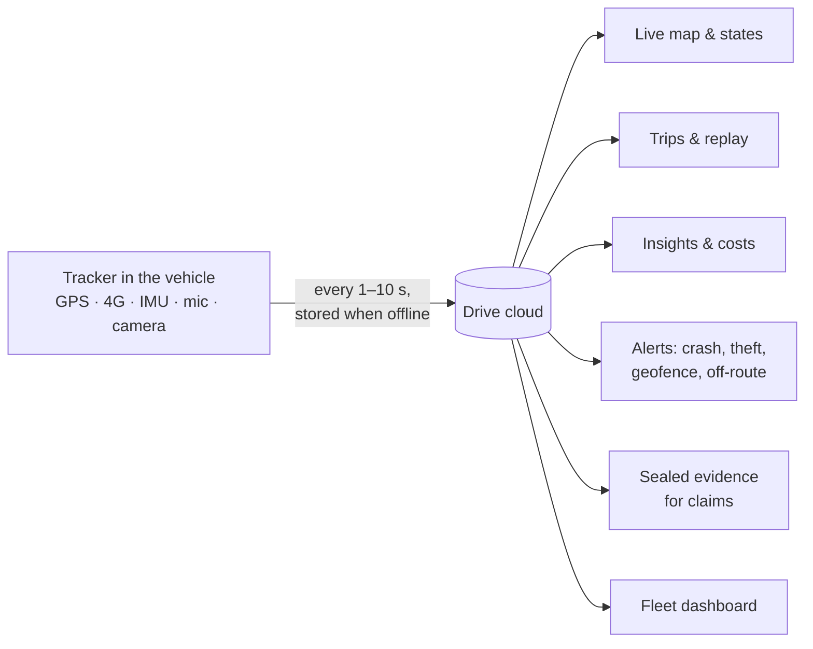

# Drive: product guide

Drive turns a small tracker wired into a vehicle into a live map, a trip diary, a safety system and
a record you can take to your insurer. It runs on Android, iOS and the web from one codebase. It
works for one scooter or a fleet of a thousand taxis.

> **Try it without hardware.** The app ships with a built-in simulator that generates six weeks of
> driving around Bengaluru, including a collision, a 2 AM drive and rush-hour traffic, plus a
> 12-vehicle demo fleet. Every screen in this guide can be tried right away.

## Who it's for

| You are | What you get most from Drive |
|---|---|
| **Car owner** | Crash SOS, trip history, real fuel costs, reminders for insurance, PUC and service, where you parked |
| **Bike / scooter owner** | Theft alerts, stolen-vehicle mode with a police link, a compact waterproof tracker |
| **Parent** | New-driver mode with a speed limit and curfew, a weekly report, share-my-ride links |
| **Taxi / auto owner** | Where every vehicle is, idling costs, route-deviation alarms, driver scores |
| **Bus / school operator** | Assigned routes with alarms, stop reports, dashcam evidence, AIS-140 devices |
| **Truck / logistics** | Drive-time geofences, stop reports, tolls per trip, Excel/PDF logbooks |
| **Business owner** | Business/personal logbook, per-vehicle costs, GST invoices, API & webhooks |

## At a glance

---

## 1. Live tracking

- **Live map** with the vehicle, the trail so far and the route ahead, following the car.
- **Speedometer** with the road's speed limit; turns amber and then red when you're over it.
- **Vehicle state**: *Running*, *Idle* (engine on, not moving) or *Stopped*, with how long it has
  been in that state.
- **Tracker health**: satellites, 4G signal, backup battery, ignition.
- **ETA** and today's distance, time and score.
- **Share my ride**: pick contacts; they get a live link with ETA that needs no app and **ends
  automatically when you arrive**.

### Works offline

GPS needs no internet; it only listens to satellites. When the vehicle has no signal (basement,
tunnel, highway dead zone) the tracker **stores every point** and uploads them in order when
coverage returns. The app shows *"Car has no signal · 184 GPS points waiting"*, then
*"Synced 184 points"*, and the trip fills itself in.

The app itself installs as an offline web app. **Offline map packs** (city or highway region) can
be downloaded in Settings so the map works on your phone without data.

## 2. Trips

- Trips grouped by day with route thumbnails, safety score and event badges.
- Filters: with alerts, commute, night.
- **Trip detail**: map with over-speed sections and event pins; speed-over-time chart you can
  scrub (synced with the map); **animated replay** at 4× to 64×; list of events; linked recordings.
- Every trip shows its **cost**: fuel at your real mileage, idling, FASTag tolls and parking.

## 3. Insights

- **Safety score** and trend.
- **Frequent places** found automatically, including places you visit often but never named. The
  app suggests naming them.
- **Top routes** with typical, best and worst times, and a commute tip:
  *"Leave before 8:33 to save 2 min"*.
- Speed profile, a when-you-drive heatmap and habits (night driving, idling, average trip).
- **Hotspots**: places where harsh braking, hard launches or speeding keep happening, named by
  landmark (*"Hebbal flyover · mostly 6 PM"*), with a tip for each.
- **Weekly report card**: distance, spend, score, where it got rough, highlights. It can be
  filtered by driver and shared.

## 4. Crash detection and SOS

A **probable collision** is a speed drop from **at least 60 km/h to 10 km/h or less within 2 s**.
For example, 80 → 4 km/h in 2 s is about 1.1 g. The tracker's motion sensor adds a second check
(a peak above about 4 g), so it works even without GPS.

When it fires:

1. A **full-screen SOS** takes over the phone, vibrates and counts down (30 s by default).
2. Unless you tap *I'm OK*, your emergency contacts get your location and 112 is one tap away.
3. The dashcam and cabin audio 15 s either side are **locked** and can't be deleted.
4. An **incident case** is opened automatically with the impact numbers and a speed chart.

All thresholds are adjustable in Settings and the event counts update as you change them.

## 5. Alerts

| Alert | When it fires |
|---|---|
| Collision | The rule above |
| Harsh braking / acceleration | ≥ 3.5 m/s² / ≥ 3.0 m/s² |
| Overspeed | Above your limit for 10 s |
| Geofence enter / exit | Crossing any zone you set |
| **Off route** | The vehicle leaves its planned route (see below) |
| Long idling | Engine on and not moving for N minutes |
| Ignition on/off, tow | Including *moved with ignition off* |
| Power cut | The vehicle battery was disconnected |
| GPS jamming | GPS lost while 4G is fine and the vehicle is still |
| Unusual night movement | A trip at an hour this vehicle is almost never driven, learnt from your own history |
| New-driver rules | Speed limit or curfew broken |

## 6. Route watch: deviation alarm ⏰

For school runs, deliveries, taxis, buses, or a family member driving somewhere new.

- The planned route is drawn with an **allowed corridor** (50 m to 1 km either side).
- A **grace time** (5 s to 3 min) ignores a quick detour around a blocked lane.
- If the vehicle stays outside the corridor longer than that, a **full-screen alarm** sounds with a
  two-tone siren and vibration. It shows how far off the vehicle is, for how long and where.
- Emergency contacts can be alerted at the same time. There are buttons to call the driver and share
  the live location.
- The banner on the Live screen shows *On route* or *Off route · 640 m*.
- Every deviation is logged with start and end times, the furthest distance off route and the place.

Try it: **Car → Route watch → Simulate a detour**.

## 7. Geofences

There are three shapes:

| Shape | What it means | Good for |
|---|---|---|
| **Circle** | A radius around a point (straight-line distance) | Home, office, a parking lot |
| **Drive time** | Everywhere the vehicle can reach **by road** in N minutes, in light, normal or rush-hour traffic | "Within 30 minutes of the depot", delivery zones, a teenager's allowed area |
| **Draw** | Tap the map to place corners | A campus, a yard, an odd-shaped district |

Why drive time matters: a place 2 km away as the crow flies can be 30 minutes away by road. The
drive-time zone is worked out on the actual road network, using speed limits scaled by traffic plus
delays at signals and turns, so it follows reality rather than a circle.

Each zone can alert on enter, exit or both, and shows its crossings from the last 7 days.

## 8. Stops and activity

- **24-hour state bar**: running, idle and stopped periods for any day. Tap one to see where it happened.
- Daily totals and the **cost of idling**.
- **Stop report**: parked stops (engine off) and long idling (engine on, 3 min or more), each with the
  place, arrival, departure and duration.
- Filter by type or by shortest stop (2 / 5 / 15 / 30 min). Export to **Excel or PDF**.

## 9. Vehicle controls

A top-down view of the vehicle shows the live state of locks, mirrors, windows, boot, lights,
hazards, engine and horn.

| Control | Needs |
|---|---|
| Lock / unlock, find my car (horn + lights), horn | Relay or CAN module |
| Remote engine start / stop (press and hold), immobilizer | Relay |
| Mirror fold, window vent, boot, headlights, hazards, pre-cool AC | CAN module (model-specific) |
| Parking guard, valet mode, speed limiter | Tracker |

Every command shows *Sending…* until the vehicle confirms it. Unsafe commands are **blocked while
driving**: engine off, mirrors, boot, horn and opening windows.

## 10. Theft protection

- **Stolen-vehicle mode** (hold to turn on): tracking every 5 s, a **police link** that needs no login
  (live position, speed, plate, IMEI), SMS to contacts, and a timeline with the FIR number.
- The engine is cut **only once the vehicle slows below 20 km/h**, and nothing happens that the thief
  would notice (no horn or lights).
- **Tamper alerts**: battery disconnected, GPS jammer, unusual night movement, towing.

## 11. Incidents and insurance claims

1. **Log incident** from Live, Alerts or any trip. Choose what happened: collision, hit & run, theft,
   vandalism, pothole, road rage, parking damage or other.
2. **Seal evidence.** The GPS track from 15 min before to 5 min after is frozen with a SHA-256
   fingerprint. Front camera, cabin camera and cabin audio are locked. **Nothing sealed can be
   deleted.**
3. The case file **remembers everything the insurer will ask for** as you type:
   - statement and a recorded voice statement
   - photos and a tap-to-mark damage map
   - other party, injuries, police FIR, witnesses and repair estimate
   - your driver and policy details, pre-filled from Settings
4. **Draft my statement with AI** writes a first-person draft from the sealed facts and your notes,
   and marks gaps like *[describe what the other vehicle did]*.
5. **Prepare claim summary**, then copy it, share it or download a claim pack. After you mark the
   case *sent to insurer*, it becomes read-only. Every change is written to a record of changes.

## 12. Money and paperwork

- **Fuel and costs**: every trip is costed at your *real* mileage, plus idling, FASTag tolls and
  parking. Group spending by destination, route, weekday or time of day, and see visit counts.
  Also shows ₹/km, ₹/day and the costliest destination.
- **Fuel log**: fill-ups give your real mileage from one full tank to the next.
- **Reminders**: insurance, PUC, RC, service by km, tyre rotation and battery, with overdue badges.
- **FASTag balance** from toll crossings.
- **Logbook**: every trip is tagged business or personal (trips to or from the office are tagged
  automatically). A monthly **Excel and PDF** export is ready for reimbursement or GST.

## 13. Drivers and family

- **Driver profiles**, identified by phone Bluetooth, key fob or RFID tag. Every trip has a driver.
- **New-driver mode**: speed limit, curfew, a list of rule breaks and a weekly report to the parent.
- **Streaks, badges and insurer score**: a smooth-driving streak, badges, and a safe-driving
  certificate with a verification code to share with your insurer for a discount.
- **Where I parked**: pin, landmark, walking directions, parking timer, note and photo.

## 14. Ask AI

Ask in plain language: *"How much did weekend trips cost in September?"*, *"When do I usually leave
office?"*, *"Where do I brake hard most?"*. When online, Claude answers from your trip table. When
offline, the phone answers the common questions itself.

## 15. Fleet dashboard (business)

- Counts by state: **Running, Idle, Stopped, Offline**. Tap one to filter.
- A live map of every vehicle, coloured by state.
- Filter by type: taxi, auto, bus, truck, bike, car.
- Each vehicle shows its plate, driver, location, speed and km today. Open it to call the driver or
  set up route watch.
- **Add a vehicle** by scanning the QR code on the tracker box, or by entering the IMEI, type, plate
  and driver.
- Fleet-wide km today and alerts.

---

## Plans and pricing

Prices are in ₹ and exclude 18% GST. **Yearly billing = 10 × monthly** (2 months free).

### Personal

| | **Free** | **Plus** · popular | **Family** |
|---|---|---|---|
| Price | ₹0 | **₹99 / month** | **₹199 / month** |
| Vehicles | 1 | 1 | up to 3 |
| Live location, today's trips | ✓ | ✓ | ✓ |
| Trip history | 7 days | 1 year | 1 year |
| Ignition, overspeed, power-cut alerts | ✓ | ✓ | ✓ |
| Geofences | 1 | Unlimited | Unlimited |
| Crash detection + SOS | | ✓ | ✓ |
| Route-deviation alarm | | ✓ | ✓ |
| Stops & activity reports | | ✓ | ✓ |
| Fuel, toll & parking costs | | ✓ | ✓ |
| Reminders, fuel log, logbook export | | ✓ | ✓ |
| Stolen-vehicle mode | | ✓ | ✓ |
| Driver profiles & new-driver mode | | | ✓ |
| Share my ride | | | ✓ |
| AI assistant & statement drafts | | | ✓ |
| Incident evidence storage | | | 30 GB |

### Business (per vehicle)

| | **Fleet** | **Fleet Pro** · popular | **Enterprise** |
|---|---|---|---|
| Price | **₹149 / vehicle / month** | **₹249 / vehicle / month** | Custom |
| Best for | Taxis, autos, delivery, small fleets | Buses, trucks, growing operators | 1,000+ vehicles |
| Live fleet map & vehicle states | ✓ | ✓ | ✓ |
| Trips, stops & idling reports | ✓ | ✓ | ✓ |
| Geofences & route-deviation alarms | ✓ | ✓ | ✓ |
| Driver scores & weekly reports | ✓ | ✓ | ✓ |
| Costs per vehicle, Excel/PDF exports | ✓ | ✓ | ✓ |
| Admin users | 3 | Unlimited, roles & SSO | Unlimited |
| Assigned routes & dispatch | | ✓ | ✓ |
| Dashcam cloud storage | | 30 days | Custom |
| AI assistant for managers | | ✓ | ✓ |
| API & webhooks | | ✓ | ✓ |
| AIS-140 certified devices, private cloud / on-premise, 99.9% SLA, white-label app | | | ✓ |

**Volume discounts** on business plans: **10% off from 50 vehicles, 15% from 200.**

### Hardware

| Device | For | Buy once | Or rent |
|---|---|---|---|
| **Drive Tracker** (wired 4G) | Cars, trucks | ₹3,999 | ₹149 / month |
| **Drive Bike** (IP67, compact) | Bikes, scooters, autos | ₹2,499 | ₹99 / month |
| **Drive Cam** (4G + dual dashcam) | Taxis, buses | ₹8,999 | ₹349 / month |
| Bring your own | Any GT06 / Teltonika / OsmAnd-compatible device | ₹0 | |

Installation is **₹499 per vehicle, free from 10 vehicles**.

### Example bills

| Customer | Choice | First payment (incl. GST) | Then |
|---|---|---|---|
| Car owner | Plus, monthly, buy Drive Tracker | ₹5,424 | ₹117 / month |
| Scooter owner | Plus, yearly, rent Drive Bike | ₹2,925 (incl. ₹499 install) | ₹2,336 / year |
| Taxi operator, 10 cabs | Fleet Pro, monthly, buy Drive Cam | ₹1,09,126 | ₹2,938 / month |
| Truck fleet, 60 trucks | Fleet, yearly, rent Drive Tracker (10% volume discount) | ₹2,00,435 | ₹2,00,435 / year (≈ ₹278 per truck per month) |

Change plan any time in **Car → Plan & billing** or **Settings**. Payments go through Razorpay
(UPI autopay, card or NACH mandate). Business accounts get a GST invoice for input tax credit.

---

## Privacy and data

- Location, audio and video are personal data under India's **DPDP Act 2023**. Drive asks for
  consent, lets passengers be told that recording is on, and deletes non-incident audio
  automatically.
- Sealed incident evidence is fingerprinted, and in production it is stored write-once so it can't be
  altered.
- Commercial and public-service vehicles need **AIS-140** certified trackers (Enterprise plan).

## More

- **[Build & scale guide](BUILD-AND-SCALE.md)**: building the hardware, servers for 1 to 10,000+
  vehicles, cost-benefit analysis and rollout.
- **[Hardware reference design](hardware.md)**: parts, wiring, firmware and the data protocol.
