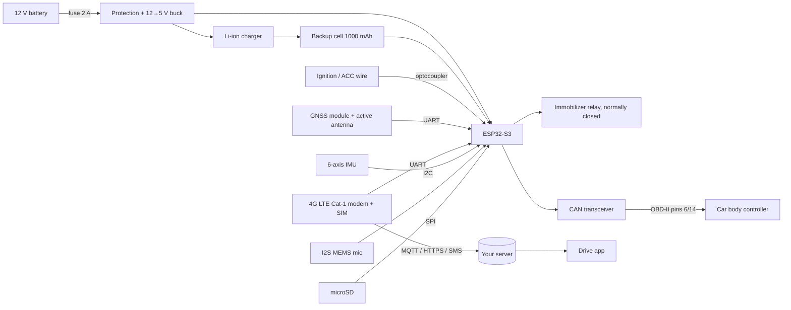

# Building your own Drive tracker

This is a reference design for a wired car tracker that feeds the Drive app: GPS, 4G, crash
sensing, immobilizer relay, optional CAN-bus body control, cabin microphone and an SD card for
offline storage. It is a starting point for a prototype, not a certified product. Prices are
rough Indian retail figures (2026) for single units.

## Does GPS work without internet?

Yes. The GPS (GNSS) receiver only listens to satellites; it needs no SIM and no data. What needs
the internet is getting positions *to your phone*. The design below handles gaps like this:

1. Every position is written to the SD card first (**store and forward**).
2. When 4G is available, the tracker uploads unsent points oldest-first, in batches, and marks them sent.
3. In a basement, tunnel or dead zone, nothing is lost. The backlog uploads when coverage returns,
   and the app fills in the trip. The app shows this as *"Car has no signal · N GPS points waiting"*.
4. Crash and theft alerts can also go out by **SMS**, which often works where data doesn't.
5. On the phone side, the app caches your trips and downloaded map regions, so it opens and works offline too.

## Block diagram



## Parts list

| Block | Suggested part | Why | Approx. ₹ |
|---|---|---|---|
| Microcontroller | ESP32-S3-WROOM-1 (N16R8) | Dual core, Wi-Fi/BLE (driver phone ID), CAN (TWAI) controller, camera + I2S support | 450 |
| 4G modem | SIMCom A7672S or Quectel EC200U-CN | LTE Cat-1 with 2G fallback, Indian bands (B1/B3/B5/B8/B40/B41), SMS | 1,100–1,400 |
| GNSS | Quectel L76K or u-blox NEO-M9N + active patch antenna | GPS + NavIC/GLONASS/BeiDou; M9N is better under flyovers | 350–1,800 |
| Motion / crash sensor | ST LSM6DSOX or Bosch BMI270 | 100 Hz+ acceleration for crash detection and motion wake-up | 350 |
| Immobilizer | 12 V 30 A automotive relay + logic MOSFET + flyback diode | Wired **normally closed**, so a tracker failure never strands the car | 150 |
| CAN interface | TJA1051 or SN65HVD230 transceiver | Locks, windows, mirrors and lights on cars that allow it (model-specific) | 100 |
| Power | Automotive buck (e.g. TPS54202) + SMBJ33A TVS + reverse-polarity MOSFET | Survives load dump and cranking dips | 250 |
| Backup power | 3.7 V 1000 mAh Li-ion + charger (BQ24075) | Keeps reporting ~24 h if the battery is cut (theft) | 300 |
| Ignition sense | PC817 optocoupler on the ACC wire | Trip start/stop and "moved with ignition off" (tow) alerts | 20 |
| Storage | microSD socket + 32 GB card | Months of GPS points, audio clips, offline buffer | 400 |
| Microphone | INMP441 I2S MEMS mic | Cabin audio around incidents | 200 |
| Camera (optional) | Separate 4G/Wi-Fi dashcam, or OV5640 on the ESP32-S3 | ESP32 video is limited to ~720p MJPEG; a dashcam gives better evidence | 700–6,000 |
| Antennas | LTE + GNSS active patch | Mount GNSS facing the sky (under the dashboard top) | 400 |
| Misc | Enclosure, 2 A inline fuse, harness, connectors | | 300 |
| SIM | M2M / IoT SIM (Airtel, Jio, Vi) | ~50 MB/month is enough for GPS at 10 s intervals | ~300/yr |

**Total for a prototype: roughly ₹5,500–7,500** without a separate dashcam.

## Wiring in the car

| Tracker wire | Connect to | Notes |
|---|---|---|
| +12 V (red) | Battery constant +12 V | Through a 2 A inline fuse, close to the tap |
| GND (black) | Chassis ground | Bare metal, short wire |
| ACC (yellow) | Ignition-switched +12 V | Detects ignition on/off |
| Relay COM/NC | In series with the fuel-pump feed (or starter signal) | NC = car works if the tracker is off |
| CAN H / CAN L | OBD-II pin 6 / pin 14 | Only if you implement body control; many cars gate these messages |
| Horn / lights (optional) | Via relay to the horn and parking-light circuits | For "find my car" on cars without CAN access |

Don't tap airbag, ABS or ECU power wiring. Get an auto electrician to do the install for a
customer's car; it can affect the vehicle warranty.

## Firmware behaviour

A starter sketch is in [`firmware/drive-tracker/drive-tracker.ino`](../firmware/drive-tracker/drive-tracker.ino).
It is an **untested skeleton** that shows the structure. It has not been compiled or flashed.

| Mode | GPS interval | Upload |
|---|---|---|
| Driving (ignition on) | 1 s logged, 10 s sent | Every 10 s, batched |
| Parked (ignition off) | Every 30 min, or on motion | Heartbeat every 30 min, deep sleep between |
| Stolen mode | 5 s | Immediately; SMS every 2 min as backup |

**On-device crash detection** (so it works without internet): trigger when *either* the IMU sees a
peak above ~4 g, *or* GPS speed falls from ≥ 60 to ≤ 10 km/h within 2 s. This is the same rule the
app uses, and it's configurable. On a crash the tracker locks the audio/video buffer (−15 s / +15 s),
sends an MQTT event, and sends an SMS with a map link to the emergency contacts.

**Immobilizer safety:** the relay only opens when GPS speed is below 20 km/h, and after a remote
command it waits until the car is stationary for 5 s. It never cuts a moving car at speed.

**Tamper and jammer detection:** GNSS signal lost while 4G is fine and the IMU is quiet points to
a jammer, so send a `gps_jam` alert. Main 12 V lost while the ignition is off means the battery was
cut, so switch to the backup cell and send `power_cut`.

## Data protocol (tracker → server → app)

Two options.

**1. Quick start: Traccar + OsmAnd protocol.** Install [Traccar](https://www.traccar.org) on a small
VPS and have the firmware send HTTP GETs to port 5055:

```
GET http://your-server:5055/?id=<IMEI>&timestamp=<unix>&lat=12.99&lon=77.57&speed=<knots>&bearing=<deg>&altitude=<m>&batt=<V>&ignition=true
```

Traccar stores positions, detects trips and exposes a REST + WebSocket API that the app can read.

**2. Your own backend: MQTT over TLS** (EMQX or Mosquitto), QoS 1:

| Topic | Direction | Payload (JSON) |
|---|---|---|
| `drive/{imei}/pos` | up | `{"v":1,"pts":[[t,lat,lng,kmh,heading,sats,hdop],...],"ign":1,"vbat":12.6,"stored":0}` (batched; `stored` = points still on SD) |
| `drive/{imei}/evt` | up | `{"type":"crash","t":1790270767,"lat":12.99,"lng":77.65,"fromKmh":78,"toKmh":4,"sec":2.0,"g":1.05}`; other types: `harsh_brake`, `harsh_accel`, `power_cut`, `gps_jam`, `tow`, `ignition_on`, `ignition_off` |
| `drive/{imei}/cmd` | down | `{"id":"c123","cmd":"immobilize","args":{"on":true}}`; other commands: `lock`, `unlock`, `horn`, `find`, `stolen_mode`, `interval` |
| `drive/{imei}/ack` | up | `{"id":"c123","ok":true,"t":1790270800}` (the app shows "confirmed by vehicle") |
| Media | up | HTTPS `PUT` to a pre-signed URL (S3 / R2) with object lock for incident evidence |

Timestamps come from GNSS time, not the phone, so buffered points upload with their true times.

On the server, a small ingest worker writes points to PostgreSQL + TimescaleDB and serves the shape
the app already expects (`src/data/source.js`: `vehicle`, `trips[].samples`, `media`, `geofences`,
`live`). The app's analytics (crash rule, costs, hotspots, reminders) run unchanged on real data.

## Regulations and privacy (India)

- **AIS-140** tracking with panic buttons is mandatory for commercial and public-service vehicles,
  not private cars. If you sell to fleets or taxis, you'll need an AIS-140 certified device.
- Modem modules must carry **TEC/MTCTE** certification; use certified modules rather than bare chips.
- Recording cabin audio of passengers is personal data under the **DPDP Act 2023**. Tell occupants,
  give an off switch, and delete non-incident audio automatically.
